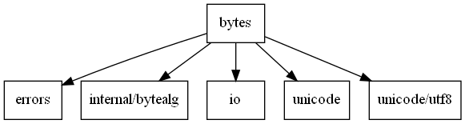
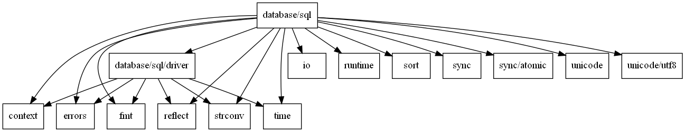

# go package graph

本意是用于将 golang 标准库的 package 间依赖关系用 dot 语言描述，实际使用时发现，生成的图片中依赖关系太多而无法作用于大规模的 go 包，对于小规模的有一定的参考意义。

## 示例：

1. bytes

    ``` shell
    $ go run main.go -p ${GOROOT}/src/bytes | tee bytes.dot | dot -T png >bytes.png && cat bytes.dot
    digraph bytes {
    node [shape=box];
    1 [label="bytes"];
    2 [label="errors"];
    3 [label="internal/bytealg"];
    4 [label="io"];
    5 [label="unicode"];
    6 [label="unicode/utf8"];
    1 -> 2;
    1 -> 3;
    1 -> 4;
    1 -> 5;
    1 -> 6;
    }
    ```

    图片输出:

    

2. database

    ```shell
    go run main.go -p ${GOROOT}/src/database | tee db.dot | dot -T png >db.png && cat db.dot   
    digraph database {
    node [shape=box];
    2 [label="context"];
    1 [label="database/sql"];
    3 [label="database/sql/driver"];
    4 [label="errors"];
    5 [label="fmt"];
    6 [label="io"];
    7 [label="reflect"];
    8 [label="runtime"];
    9 [label="sort"];
    10 [label="strconv"];
    11 [label="sync"];
    12 [label="sync/atomic"];
    13 [label="time"];
    14 [label="unicode"];
    15 [label="unicode/utf8"];
    1 -> 2;
    1 -> 3;
    1 -> 4;
    1 -> 5;
    1 -> 6;
    1 -> 7;
    1 -> 8;
    1 -> 9;
    1 -> 10;
    1 -> 11;
    1 -> 12;
    1 -> 13;
    1 -> 14;
    1 -> 15;
    3 -> 2;
    3 -> 4;
    3 -> 5;
    3 -> 7;
    3 -> 10;
    3 -> 13;
    }
    ```

    图片输出:
    
